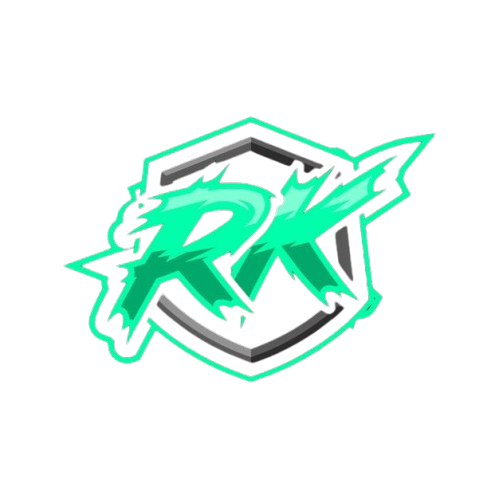

# 🎮 Rock Paper Scissors Game

A beautifully designed, interactive Rock Paper Scissors game built with HTML, CSS, and JavaScript. Features stunning visual effects, smooth animations, and an engaging user experience!



## ✨ Features

- **Intuitive Gameplay** - Easy to learn, fun to master
- **Stunning Visual Effects** - Glowing animations and smooth transitions
- **Score Tracking** - Keep track of wins, losses, and ties
- **Responsive Design** - Works perfectly on all devices
- **Modern UI/UX** - Sleek, futuristic design with glassmorphism effects
- **Player Customization** - Enter your name for a personalized experience

## 🎯 How to Play

1. **Enter your name** in the input field
2. **Choose your weapon** - Rock 🪨, Paper 📃, or Scissors ✂️
3. **Watch the battle** unfold with smooth animations
4. **Track your progress** with the built-in score system
5. **Reset anytime** to start fresh

## 🚀 Quick Start

1. Clone this repository:
   ```bash
   git clone https://github.com/Rishan-Koiry/Rock-Paper-Siscor-By-JS-html-css.git
   ```
2. Navigate to the project directory:
   ```bash
   cd Rock-Paper-Siscor-By-JS-html-css
   ```
3. Open `index.html` in your web browser
4. Start playing!

## 🛠️ Technologies Used

- **HTML5** - Structure and content
- **CSS3** - Styling with advanced animations and effects
- **JavaScript** - Game logic and interactivity
- **Google Fonts** - Orbitron font family

## 🎨 Design Features

- Gradient backgrounds with shifting animations
- Glassmorphism cards and containers
- Neon glow effects and text shadows
- Floating orb animations
- Responsive mobile-first design
- Smooth hover and click interactions

## 🤝 Contributing

Contributions are welcome! Feel free to:

- Report bugs
- Suggest new features
- Submit pull requests
- Improve documentation

## 👨‍💻 Author

**Rishan Koiry**  
_Game Developer & Web Designer_

Passionate about creating engaging interactive experiences and modern web applications.

### Connect with me:

- 🐙 **GitHub**: [@Rishan-Koiry](https://github.com/Rishan-Koiry)

- 📧 **Email**: koiryrishan1@gmail.com


## 📄 License

This project is licensed under the MIT License - see the [LICENSE](LICENSE) file for details.

## 🌟 Show Your Support

If you like this project, please give it a ⭐ on GitHub!

---

**Enjoy playing Rock Paper Scissors!** 🎉
